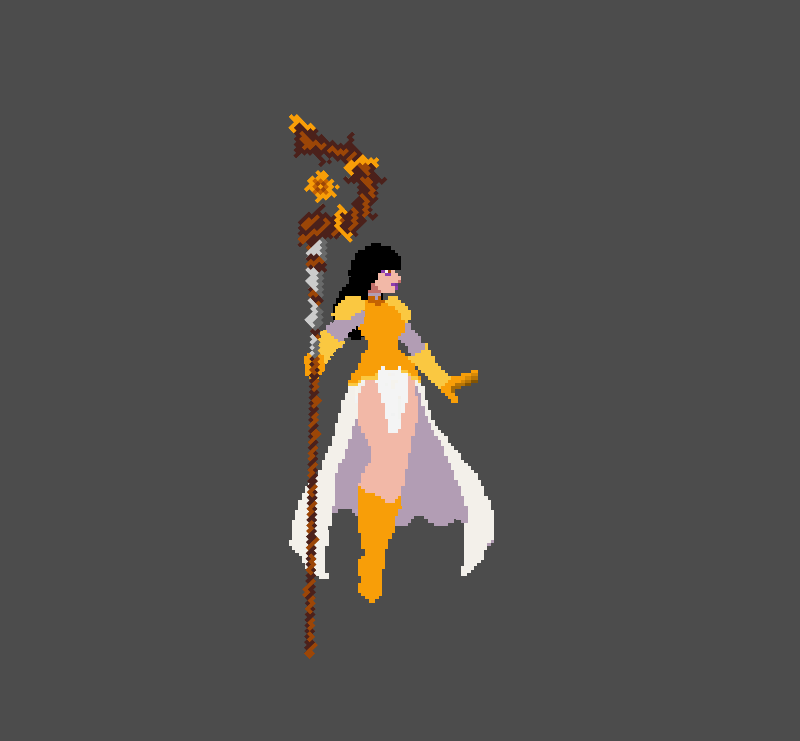
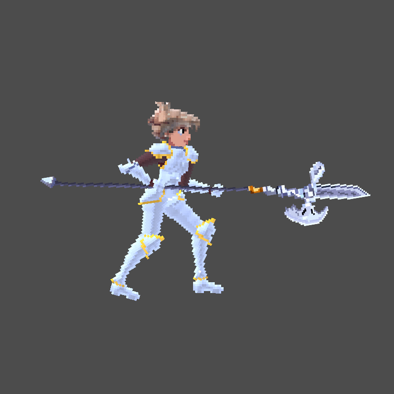
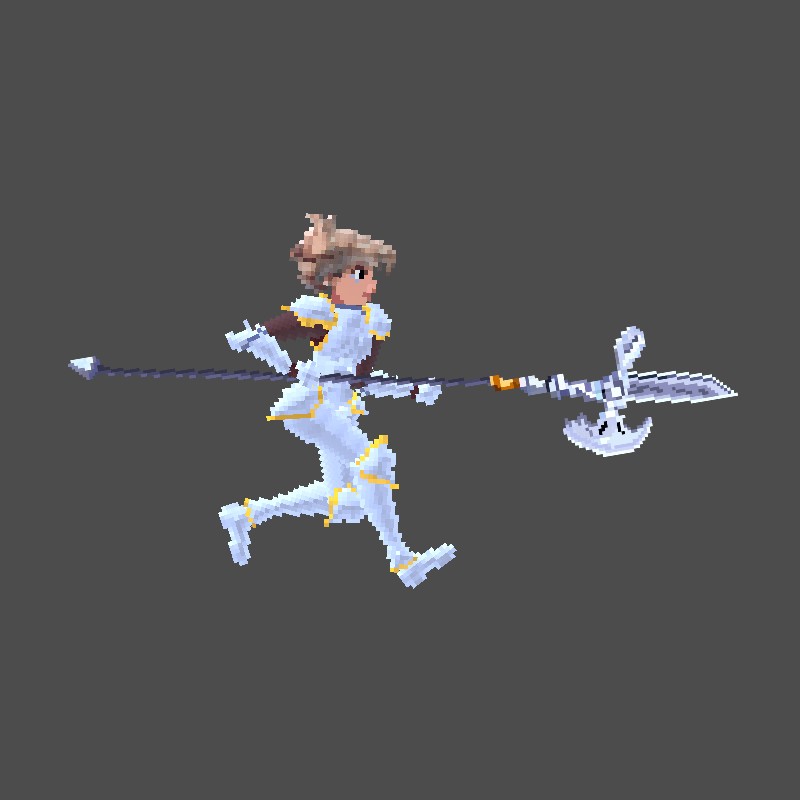
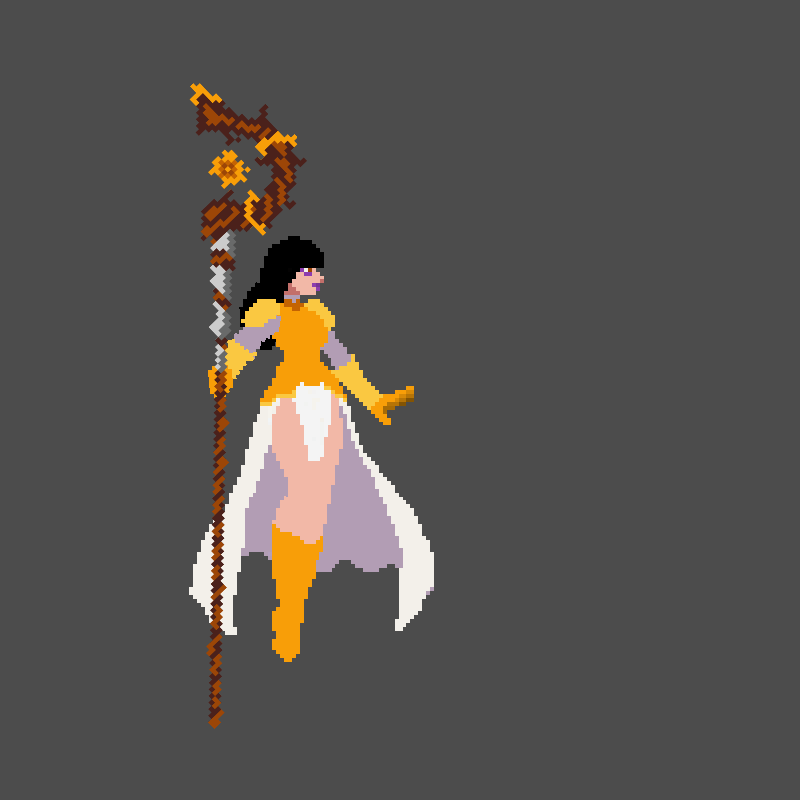
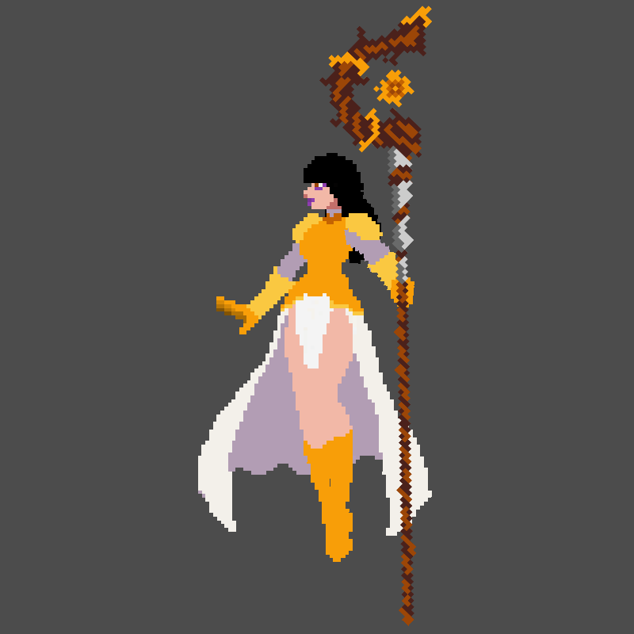
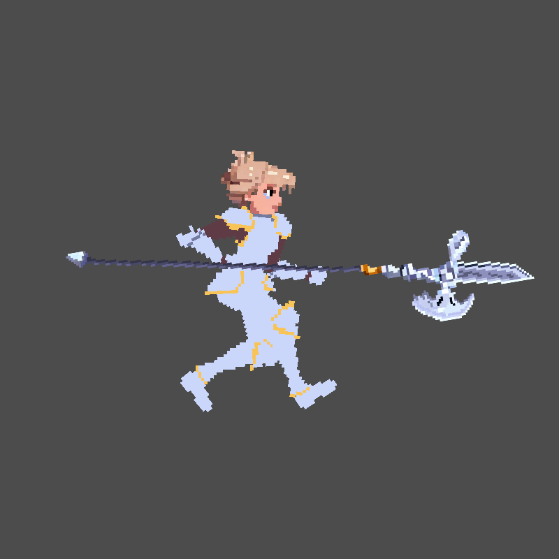
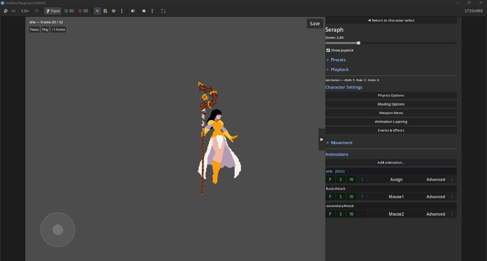
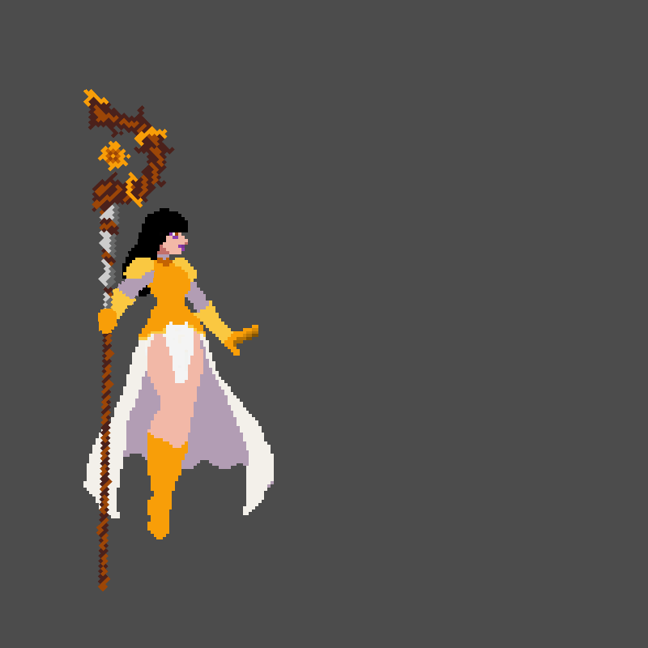
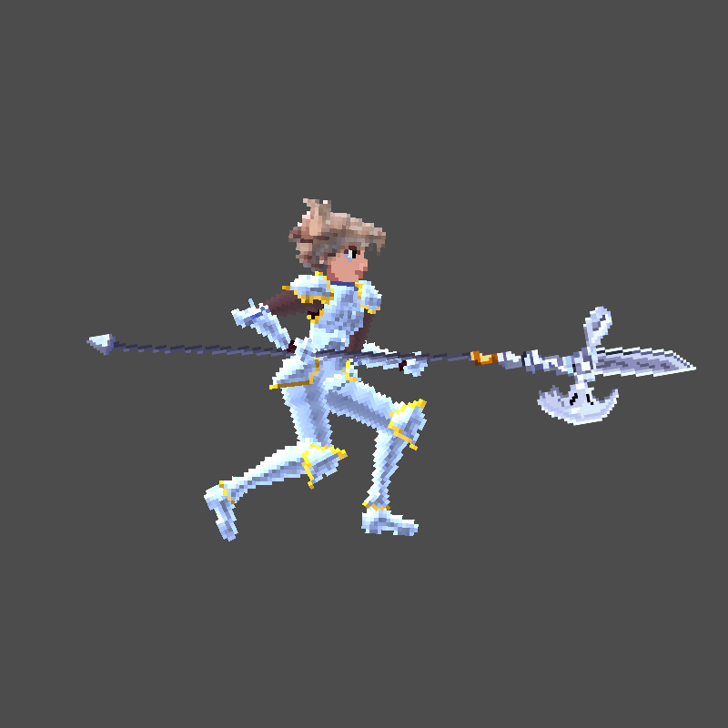
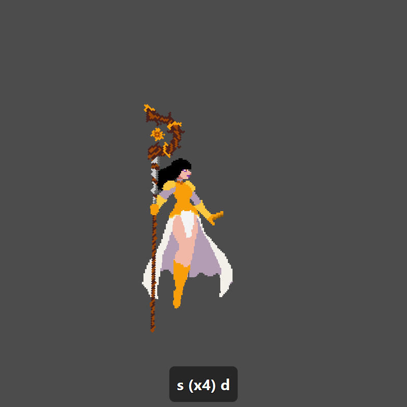

# AniManager — Godot 4 Runtime

[](https://godotengine.org/)
[](LICENSE)

**2D skeletal animation runtime for Godot 4** — the game-engine half
of a tablet-to-game pipeline. Characters are drawn, rigged, and
animated in [AniMate](https://animate.htdevs.net/)
(a mobile animation studio for iPad / Android tablets); this plugin
imports the exported `.animrig` files and plays them back with
runtime features the authoring app doesn't need to know about:
cross-fades, procedural cloth & hair physics, upper/lower-body
animation layering, cursor-aimed limbs, and normal-mapped 2D
lighting.



---

## Features

**Import & playback**
- Drop a single `.animrig` file into your project — it imports as a
  native Godot `Resource` with every part texture embedded, and the
  `AniAnimationPlayer2D` node plays it: looping, speed control,
  sub-frame scrubbing, frame events as signals.
- Full interpolation support: linear, ease in/out/in-out, stepped,
  and custom cubic bezier (Newton-Raphson solver matching the
  authoring app bit-for-bit), with shortest-arc angle blending.
- Two-bone analytic IK solved during the FK walk, with keyframable
  per-frame targets and joint rotation constraints.

**Runtime animation systems** (things keyframes can't do)
- **Cross-fades** — blend from any clip to any clip from any frame
  (`crossfade_to`). Authored transition clips take precedence;
  everything else blends procedurally. Interrupt a run with a dodge
  and nothing pops.

  

- **Body layering** — play a second clip on a bone *subtree* while
  the base clip keeps the rest: run with the legs, attack with the
  upper body (`play_layer`). The mask can name several subtree
  roots (`"Right Arm Upper Bone, Left Arm Upper Bone, Neck Bone"`)
  for rigs whose torso *is* the root. Faded enter/exit, overlay
  hit-events fire mid-run, and a charge-hold can park the overlay
  on a casting pose until released (`set_layer_hold`).

  

- **Bone aiming** — steer any bone toward a world direction while
  its children keep playing their animation (`set_bone_aim`): a
  throwing arm tracks the cursor while the hand animates the throw.

  

- **Cloth, hair & limb physics** — bones flagged by *naming
  convention* (no export flags, no code) get verlet follow-through
  simulation that reacts to real gameplay motion: dashes,
  knockbacks, facing flips. Three material classes (cloth / hair /
  limb) with independent tuning, and *sync groups* that keep the
  front and back panels of a skirt or open coat swinging as one
  sheet across z-layers. Zero per-clip authoring cost.

  

- **Shaded mode** — parts painted with material/height masks in the
  authoring app render through per-part shaders: metal picks up a
  matcap reflection, lit pixels get normal-mapped diffuse from a
  movable light, emissive glows, unpainted parts stay exactly as
  drawn. Each material class has its own controls (metalness and
  tint, diffuse wrap, emissive energy, rim light). Flat pixel art
  that responds to scene lighting.

  

---

## The playground: a combat sandbox

An included scene (`addons/animanager/playground/playground.tscn`;
run it with F6 or from **Project → Tools → AniMate Playground**)
for dialing all of it in without a game around it. Create a
character from its clips, excite the physics with an on-screen
joystick, and tune every parameter with live sliders. Settings can
be shared across a character's animations or overridden for one
clip, and full snapshots save as named presets.



It started as a tuning panel and grew into a place to prototype
**game feel**. You can bind a character's clips to keys and play
them, with effects, weapons and aiming, before any gameplay code
exists. Everything it does goes through the node's public API
(`animation_event`, `crossfade_to`, `set_bone_aim`, `play_layer`,
`get_bone_world_transform`), which is the same API a game ships
with.

**Frame events become effects.** Events placed on the AniMate
timeline show up in the playground automatically, grouped by clip
and frame. Bind one to an effect with no code:

- **Projectiles:** flipbook spritesheets that launch along the
  facing or toward the cursor.
- **Bursts:** muzzle-flash style one-shots.
- **Beams:** anchored to a bone, grow gradually, and end on a
  paired event.
- **Charge-up loops:** follow a bone until a stop event kills them.

Anchors are bone-local, so an effect placed at a staff's tip stays
on the tip through the swing.



**Hold-to-charge attacks.** A held input parks the clip on a hold
frame. On release it plays the clip's tail. If the hold passes a
charge threshold, a *different* animation plays instead, so one
button gives a quick strike on a tap and a charged release on a
hold. Each clip has a release policy (complete, cut to idle, or
commit past a cutoff frame), and a committed attack blocks new
inputs until it lands.

**Two-handed weapons.** A weapon fitted to one hand takes its
rotation from the line between both hands, so it always sits
between them. A steady-grip lock holds the weapon and both hands
together when a clip scissors the arms. Frame events can take one
hand off the grip mid-swing (`weapon_release`) and put it back
(`weapon_engage`) without the weapon jumping.



**A playable test in minutes.** Bind keys or mouse buttons to
clips and mark clips as movement animations. The character runs
and auto-faces the direction of travel, returns to idle when
released, and can face the cursor while strafing. Per-clip cursor
aiming turns an arm (and its projectiles) toward the mouse
mid-attack. Crossfade length is one slider across every
transition.



---

## Requirements

- Godot 4.x.
- An `.animrig` (or `.rig` + `.parts/` folder) exported from
  AniMate. This runtime implements `.rig` format spec v1.6.
- `examples/quarter_turn.rig` in this repo is a minimal rig for
  verifying setup without the app.

## Installation

Copy `addons/animanager/` into your project's `addons/` directory:

```powershell
cd <your-godot-project>
git clone https://github.com/haydentaylor-devs-prog/animanager-godot.git temp
New-Item -ItemType Directory -Force -Path addons | Out-Null
Move-Item temp\addons\animanager addons\
Remove-Item -Recurse -Force temp
```

(bash: `mkdir -p addons && cp -r temp/addons/animanager addons/ && rm -rf temp`)

Then in Godot: **Project → Project Settings → Plugins → tick
AniManager**. Any `.rig`/`.animrig` files in the project reimport
automatically. To update, replace the folder and
**Project → Reload Current Project** — stable `.uid` sidecars keep
scene references intact.

## Quick start

```text
1. Drop an .animrig into the project (auto-imports).
2. Add an AniAnimationPlayer2D node (under Node2D in Create Node).
3. Set its Rig property to the imported resource — part sprites
   auto-bind from the bundle.
4. Tick Auto Play (or call play() from a script).
```

Attach effects or weapons to bones:

```gdscript
func _process(_delta: float) -> void:
    var hand := $AniAnimationPlayer2D.get_bone_world_transform("Hand_R")
    $Particles.global_position = hand.origin
```

Cloth just needs bone names: any bone containing `cape`, `cloth`,
`loincloth`, `tassel` or `scarf` (configurable) simulates; `hair`,
`ponytail`, `braid` etc. use the hair tuning; a flyer's node can
opt legs into the limb class. Name `Skirt Cloth Front` /
`Skirt Cloth Back` and the panels sync as one sheet.

---

## API summary

**Key properties**

| Property | What it does |
|---|---|
| `rig` | The imported `AniRigResource`. |
| `sprite_bindings` | Bone uuid/name → `Texture2D` overrides (auto-bind fills the rest). |
| `auto_play` / `speed` / `loop_override` | Playback control. |
| `zero_root_translate` | Subtract the frame-0 root offset (for games that move the body themselves). |
| `shaded` / `matcap` / `light_direction` / `metal_tint` | Shaded-mode rendering. |
| `metalness` / `diffuse_wrap` / `emissive_energy` / `rim_strength` / `rim_power` | Per-material shading response. |
| `cloth_*`, `hair_*`, `limb_*` | Physics keywords + stiffness/damping/inertia per material class. |
| `draw_bones_in_editor` + colors | Debug bone rendering for unbound rigs. |

**Key methods**

| Method | What it does |
|---|---|
| `play()` / `pause()` / `stop()` / `set_current_frame(f)` | Playback. |
| `crossfade_to(rig, seconds)` | Blend into another clip from the current pose. |
| `play_layer(rig, mask_roots, fade)` | Drive one or more bone subtrees (comma-separated roots) from a second clip (attack-while-moving). |
| `set_layer_hold(frame)` / `release_layer_hold()` | Park the overlay on a pose (hold-to-cast). |
| `stop_layer(fade)` | Cancel the overlay early. |
| `set_bone_aim(bone, angle, weight)` / `clear_bone_aim(bone)` | Steer a bone toward a direction over its animation. |
| `get_bone_world_transform(uuid_or_name)` | Bone transform for effect/weapon attachment. |
| `get_part_material(uuid_or_name)` | A shaded part's `ShaderMaterial` for per-part tweaks. |

**Signals**: `animation_finished`, `animation_looped`,
`animation_event(name, payload)` (fires from the base *and* layer
playheads), `layer_finished`.

---

## Scope & limitations

Implements `.rig` spec v1.6. Honest gaps:

| Feature | Status |
|---|---|
| FK + IK + constraints + all interpolation types | ✅ |
| Shade-mask sidecars (material + normal maps) | ✅ |
| Cross-fades, body layering, bone aim, cloth/hair/limb physics | ✅ (runtime-side, no format changes) |
| Per-frame audio clips | ❌ Spec v2 item — the authoring app composits audio into its own MP4 exports today. |
| Keyframed mesh (FFD) deformation playback | ❌ Spec v2 item — bakes into part PNGs app-side for now. |

The evaluator, IK solver and physics are pure GDScript — real-time
for typical rigs (10–30 bones, several IK chains + sim bones) on
mid-range mobile hardware. A GDExtension port is the escape hatch
if a project needs hundreds of simulated bones.

## Troubleshooting

<details>
<summary>Common issues (click to expand)</summary>

**Bones radiate from one point / parse errors on enable** — pull
the latest; both were early-version bugs (pre-`ee7c661` /
pre-`5ebc536`).

**`Invalid UID` warnings after updating** — toggle the plugin off
and on, right-click the `.rig` → Reimport, save the scene. Only
needed once when updating from installs older than `c779de3`.

**`AniAnimationPlayer2D` missing from Create Node** — toggle the
plugin off/on; check the Output panel for errors.

**Character mirrored/upside-down** — AniMate authors Y-down like
Godot; a mirrored rest pose means the rig was authored assuming
Y-up. Re-author, or `Scale (1, -1)` a parent node.

**Editor view doesn't update while scrubbing** — the editor
redraws from `_process`; play the scene, or drive
`set_current_frame` from a tool script.

</details>

---

## About this project

This runtime is one half of a solo-built pipeline: characters are
drawn and animated entirely on a tablet in AniMate, exported as
single-file `.animrig` bundles, and dropped into Godot — where this
plugin adds the systems that only make sense at runtime (physics
that react to gameplay, layered attacks, aimed limbs, dynamic
lighting). A consuming game's test harness keeps 570+ automated
checks over the importer, evaluator, IK, cross-fade, layering and
physics, so the format spec, the exporter, and this runtime stay
provably in sync.

Bug reports, format questions, and PRs are welcome via
[GitHub issues](https://github.com/haydentaylor-devs-prog/animanager-godot/issues).

## License

MIT — see [LICENSE](LICENSE).
